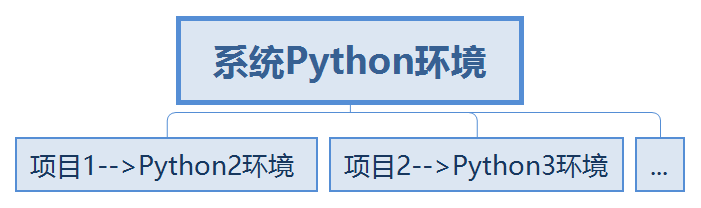

# Python 创建虚拟环境

### 概述

Python 应用程序会使用不用的软件包和特定版本的环境，这就意味着一个 Pyhton 安装无法满足每个应用程序的要求，如图所示，两个项目分别需要 Python2 和 Python3 不用的版本。为了解决这个问题，可以通过创建 Python 的虚拟环境(virtual environment)，也就是一个目录，其中包含特定的Python和软件包，每个项目有其独立的虚拟环境互不影响。  


***

### 创建虚拟环境

#### 1. 使用 **venv** (Python3.3及以上)
在需要创建虚拟环境的目录下使用命令，[`dir_name`] 是创建的虚拟环境的目录名称，自定义：
```
python3 -m venv [dir_name]
```

创建虚拟环境后，可以激活使用

在windows上
``` 
[dir_name]\Scripts\activate.bat
```

在Unix或MacOs上
```
source [dir_name]/bin/activate
```
退出虚拟环境
```
deactivate / Unix/MacOs 下
.\Scripts\deactivate.bat  / windows 下
``` 
***
#### 2. 使用 **virtualenv** 
安装 virtualenv 
```
pip install virtualenv
```
创建虚拟环境
```
virtualenv [env_name]
virtualenv venv 创建一个名为venv的虚拟环境，也就是一个目录
virtualenv --no-site-packages 如果不需要系统包，加上此参数
```
激活使用

在windows上
```
[env_name]\Scripts\activate.bat
```
在Unix/MacOs上
```
source [env_name]/bin/activate
```
退出虚拟环境
```
deactivate  \ Unix/MacOs 下
.\Scripts\deactivate.bat  \ windows 下
```
***
#### 3. 使用conda
Conda 是一个开源的软件包管理系统和环境管理系统，用于安装多个版本的软件包及其依赖关系，并在它们之间轻松切换。可以直接下载安装anaconda进行安装

conda安装

具体的安装看官方的文档

<https://docs.conda.io/projects/conda/en/latest/user-guide/install/index.html>

创建虚拟环境
```
conda create -n [env_name] python=version
conda create -n venv python=3.9.1
```

激活虚拟环境

在Windows 上
```
activate [env_name]
```
在Unix/MacOs 上
```
source activate [env_name]
```

退出虚拟环境
```
deactivate  \ windows 下
source deactivate \ Unix/MacOs 下
```
***
### 主要区别
venv 是 Python 从3.3版本开始自带的虚拟环境，因此它只支持之后的版本，很多操作和virtualenv相同，但是两者的运行机制不同。 所以如果使用Python3.3及以上的版本，推荐使用venv，否则只能使用virtualenv。

conda 通常和 anaconda 存在，是另一种包的管理方式，对应pip，它可以在系统不存在某个 Python 版本的情况下创建某个版本的虚拟环境。

*** 
**本人水平有限，若文章中存在错误请各位指正，谢谢**


### Support or Contact

written by whyan
